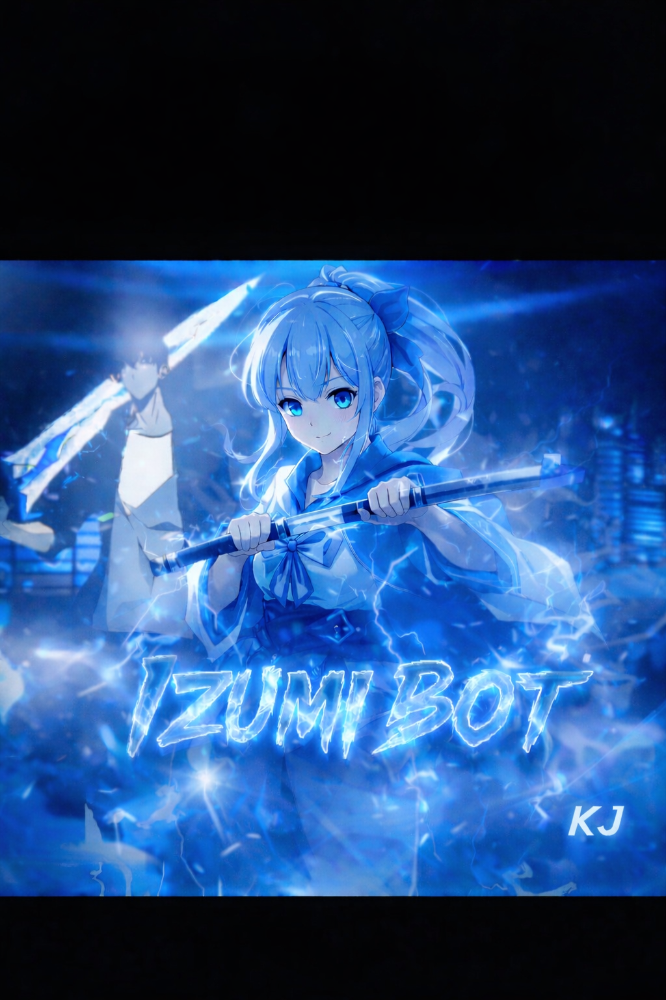

<div align="center">



# 🌸 Izumi-Bot 🌸

### *O Bot de WhatsApp Mais Completo que Você Vai Conhecer!* ✨

[](https://wa.me/+5541996367048)
[](https://nodejs.org/)
[](https://www.mongodb.com/)
[](https://developer.mozilla.org/pt-BR/docs/Web/JavaScript)

**Versão:** 1.0.0 | **Status:** 🔴 Desativado | **Licença:** Reservada 

---

### 💝 *"Eu... eu posso fazer muito mais do que você imagina!"* - Izumi

---

</div>

## 📖 Sobre o Projeto

**Izumi-Bot** é um bot multifuncional para WhatsApp inspirado na adorável Izumi Sagiri de *Eromanga Sensei*! 🎨

Desenvolvido usando **Baileys** e **Node.js**, o Izumi oferece desde comandos administrativos até um **sistema de RPG completo** com classes, dungeons, guilds, pets e muito mais!

### ✨ Por que Izumi-Bot?

- 🎮 **Sistema RPG Completo** - classes, dungeons infinitas, sistema de guilda e muito mais!
- 🎭 **Multi-Funcional** - Mais de 150+ comandos em 9 categorias diferentes
- 💎 **Sistema Premium** - Benefícios exclusivos para usuários VIP
- 🛡️ **Proteção Avançada** - Anti-link, anti-spam, anti-flood e muito mais
- 🌸 **Kawaii** - Interface linda e mensagens inspiradas na Izumi!

---

## 🎯 Funcionalidades Principais

<div align="center">

| 🎭 Categoria | 📝 Descrição | ⭐ Destaques |
|:---:|:---|:---|
| **👑 Admin** | Comandos de moderação de grupo | Ban, Antilink, Antiflood, Welcome |
| **🧙‍♂️ RPG** | Sistema de RPG completo e imersivo | Classes, PvP, Dungeons, Guilds, aventuras |
| **🥳 Diversão** | Entretenimento e interações | Ship, Chance, Memes, Top5, Casal |
| **🎮 Jogos** | Mini-games divertidos | Jogo da Velha, Quiz, Forca, piff-paff |
| **🔱 Dono** | Comandos exclusivos do criador | Broadcast, Ban Global, Eval, Premium |
</div>

---

## 🎮 Sistema RPG - O Coração do Izumi

<details>
<summary><b>🗡️ Clique para ver todos os recursos do RPG</b></summary>

### 🌟 Classes Disponíveis
- ⚔️ **Guerreiro** - Tank com alto dano físico
- 🔮 **Mago** - Especialista em magia destrutiva
- 🏹 **Arqueiro** - Ataque à distância preciso
- 🗡️ **Assassino** - Críticos devastadores
- 🛡️ **Paladino** - Tank e suporte divino
- 💀 **Necromante** - Magia sombria e invocações
- ⛪ **Clérigo** - Suporte e cura poderosa
- 🪓 **Berseker** - Dano brutal sem controle
- ☠️ **Ceifador** - ?
- 🎭 **Ladino** - Sorte e roubo de itens

### 🎯 Sistemas Principais
- 📊 **100 Níveis de Progressão**
- ⚔️ **Sistema de Combate Tático** (PvE e PvP)
- 🏰 **Dungeons Épicas** (Fácil → Impossível)
- 👥 **Sistema de Guilds** (Wars, Raids, Rankings)
- 💍 **Casamento entre Players**
- 🛠️ **Crafting & forjas**
- 💎 **Sistema de Encantamento**
- 📜 **Quests Épicas** (História, Diárias, Semanais)
- 🏆 **Rankings Globais**
- 🎪 **Eventos Especiais**
- ⭐ **Sistema de Prestígio**

### 🎁 Raridades de Itens
```
⚪ Comum → 🟢 Incomum → 🔵 Raro → 🟣 Épico → 🟠 Lendário → 🔴 Mítico → 🟡 Divino
```

</details>

---

## 🚀 Instalação

<details>
<summary><b>📋 Pré-requisitos</b></summary>

<br>

Você precisa ter instalado:

- 📦 [Node.js](https://nodejs.org/) v16 ou superior
- 📱 [Git](https://git-scm.com/)
- 🗄️ [MongoDB](https://www.mongodb.com/) (ou conta no MongoDB Atlas)
- 📲 WhatsApp instalado no celular
- 💻 Termux (Android) ou Terminal (PC/Linux)

</details>

</details>

---

## 📚 Como Usar

<details>
<summary><b>🎯 Comandos Básicos</b></summary>

<br>

```bash
# Ver menu principal
!menu

# Ver menu específico
!menuadm          # Comandos de administração
!menurpg          # Sistema RPG completo
!menudiversao     # Entretenimento
!menujogos        # Mini-games
!menudono         # Apenas para o dono

# Ajuda sobre comando específico
!ajuda comando
```

</details>

<details>
<summary><b>🧙‍♂️ Começar no RPG</b></summary>

<br>

```bash
# 1. Registrar-se
!criar

# 2. Ver seu perfil
!perfil

# 3. Começar a aventura!
!pve          # Lutar contra monstros
!daily             # Recompensa diária
!trabalhar         # Ganhar gold
!qdaily            # Ver missões disponíveis
```

</details>

<details>
<summary><b>🎮 Exemplos de Uso</b></summary>

<br>

```bash

# 🎮 Jogos
!quiz                                # Quiz de conhecimentos
!velha @user                         # Jogo da velha
!ppt pedra                          # Pedra, papel ou tesoura

# 🥳 Diversão
!ship @user1 @user2                  # Calcular compatibilidade
!gay @user                           # Porcentagem aleatória
!meme                                # Meme aleatório

# 👑 Admin (Apenas admins)
!ban @user                           # Banir membro
!antilink on                         # Ativar antilink
!marcar Reunião importante!          # Marcar todos
```

</details>

<details>
<summary><b>🎨 Menus Estilizados</b></summary>

<br>

**🌸 Exemplo do Menu Principal:**

```

╭═════════════════━╮
║•⪩ 𝘿𝘼𝙏𝘼: 01/01/2020
║•⪩ 𝙃𝙊𝙍𝘼: 12:00
║•⪩ 𝙐𝙎𝙐𝘼́𝙍𝙄𝙊: KDSjohn-KJ
║•⪩ 𝙂𝙍𝙐𝙋𝙊: Izumi Bot
┝═════════════════━╯
║ ╭══════•⪩ _*𝐌𝐄𝐍𝐔𝐒*_
║ ┃⏤͟͟͞͞ ⩺👑 !menuadm
║ ┃⏤͟͟͞͞ ⩺🧙‍♂️ !menurpg
║ ┃⏤͟͟͞͞ ⩺🥳 !menudiversao
║ ┃⏤͟͟͞͞ ⩺🎮 !menujogos
║ ┃⏤͟͟͞͞ ⩺🔱 !menudono
║ ╰══════════════〢
┝══════•⪩ 𝙋𝙍𝙀𝙁𝙄𝙓𝙊 !
║ ╭══════•⪩ _*𝑶𝑼𝑻𝑹𝑶𝑺*_
║ ┃⏤͟͟͞͞ ⩺⛅ !clima cidade
║ ┃⏤͟͟͞͞ ⩺❓ !fatos
║ ┃⏤͟͟͞͞ ⩺🏓 !ping
║ ┃⏤͟͟͞͞ ⩺📱 !ddd
║ ┃⏤͟͟͞͞ ⩺➕ !calculadora
║ ┃⏤͟͟͞͞ ⩺♐ !signo
║ ┃⏤͟͟͞͞ ⩺📊 !enquete
║ ┃⏤͟͟͞͞ ⩺🔗 !encurtador
║ ╰══════════════〢
┝══════════════〢
║ ╭══════•⪩ _*𝑬𝑿𝑻𝑹𝑨*_
║ ┃⏤͟͟͞͞ ⩺📋 !infobot
║ ┃⏤͟͟͞͞ ⩺⚠️ !bug
║ ┃⏤͟͟͞͞ ⩺💡 !sugestao
║ ╰══════════════〢
╚══════════════〢

💡 _Solicitado por: 𝐁𝐫𝐮𝐧𝐨 𝐊𝐨𝐫𝐭𝐞 ွဳ⃟☕_

💡 Digite !ajuda <comando> para mais informações
```

</details>

---

## 🛠️ Tecnologias Utilizadas

<details>
<summary><b>📦 Stack Completo</b></summary>

<br>

<div align="center">

| Tecnologia | Versão | Uso |
|:---:|:---:|:---|
|  | v18+ | Runtime JavaScript |
|  | Latest | Conexão WhatsApp |
|  | v6+ | Banco de dados |
|  | Latest | Processamento de mídia |
|  | Latest | Requisições HTTP |

</div>

</details>

<details>
<summary><b>📁 Estrutura do Projeto</b></summary>

<br>

```
izumi-bot/
├── 📂 src/
│   ├── 📂 commands/      # Todos os comandos organizados
│   ├── 📂 rpg/           # Sistema RPG completo
│   ├── 📂 handlers/      # Gerenciadores de eventos
│   ├── 📂 database/      # Models e controllers
│   ├── 📂 utils/         # Utilitários e helpers
│   └── 📂 config/        # Configurações
├── 📂 data/              # Dados salvos (JSON/DB)
├── 📂 assets/            # Imagens, fontes, áudios
├── 📂 logs/              # Logs do sistema
├── 📂 auth_info/         # Sessão do WhatsApp
├── 📄 index.js           # Arquivo principal
├── 📄 package.json       # Dependências
└── 📄 .env               # Variáveis de ambiente
```

</details>

---

## 🐛 Reportar Bugs

<details>
<summary><b>🔧 Encontrou um problema?</b></summary>

<br>

Encontrou um bug? Use o comando `!bug` no bot ou abra uma [Issue](https://github.com/KDSjohhn-KJ/izumi-bot/issues) no GitHub!

**Como reportar:**
1. Descreva o problema
2. Passos para reproduzir
3. Screenshots (se possível)
4. Versão do bot

</details>

---

## 💎 Sistema Premium

<details>
<summary><b>✨ Quer benefícios exclusivos?</b></summary>

<br>

Adquira o Premium e aproveite!

### Benefícios:
- ✨ Sem cooldown em comandos
- 🎮 +15% XP e Gold no RPG
- 📦 +20% Drop Rate
- 🎨 Badge exclusiva
- 🎯 Comandos Premium
- ⚡ Prioridade no suporte

**Contato:** [WhatsApp](https://wa.me/+5541996367048)

</details>

---

## 📞 Suporte

<details>
<summary><b>💬 Precisa de ajuda?</b></summary>

<br>

Entre em contato através de:

- 📱 **WhatsApp:** [Clique aqui](https://wa.me/+5541996367048)
- 💬 **Grupo do Bot:** [Entrar](https://chat.whatsapp.com/K453PfiZvA98wrZ8bhiLvw?mode=gi_t)
- 🐛 **Issues:** [GitHub Issues](https://github.com/KDSjohn-KJ/izumi-bot/issues)
- 📧 **Email:** john.demesiere@gmail.com

</details>

---

## 📜 Licença

<details>
<summary><b>⚖️ Informações Legais</b></summary>

<br>

Este projeto está sob licença. Veja o arquivo [LICENSE](LICENSE) para mais detalhes.

</details>

---

## ❤️ Agradecimentos

- 🌸 **Izumi Sagiri** - Inspiração para o bot
- 👥 **Comunidade Baileys** - Pela incrível biblioteca
- 👨‍💻 **Equipe** - Por tornarem o projeto realidade
- 💖 **Você** - Por usar a Izumi-Bot!

---

## ⭐ Estatísticas

<div align="center">


</div>

---

## 👨‍💻 Desenvolvedor

<div align="center">

### 🌸 Criado com 💖 por [KDSjohn-KJ]

[](https://github.com/KDSjohn-KJ)
[](https://wa.me/KDSjohhn-KJ)
[](https://instagram.com/cwb._kj)

</div>

---

<div align="center">

### 🌟 Se gostou do projeto, deixe uma ⭐!

**"N-não é como se eu quisesse sua estrela ou algo assim...!"** - Izumi 💝

---

**© 2025 Izumi-Bot | Todos os direitos reservados**

*Feito com Node.js, café e muito amor* ☕💖

</div>

<details>
<summary>❗Nota Legal</summary>

  Este é um projeto independente e não oficial, desenvolvido por fãs para fins de entretenimento. O nome Izumi-Bot, seu código-fonte, sistema de RPG, banco de dados e lógica de comandos são de minha autoria exclusiva. No entanto, a personagem Izumi Sagiri, seu design original e elementos do anime Eromanga Sensei são propriedades intelectuais da Kadokawa, A-1 Pictures e do autor Tsukasa Fushimi. Este bot não possui fins lucrativos e não é afiliado aos detentores dos direitos autorais.
</details>
